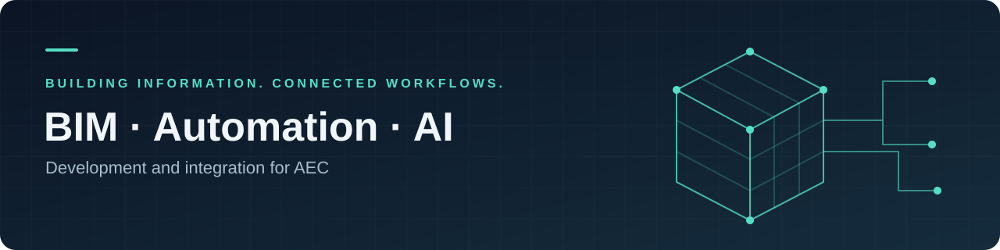

# Theresa Safwat

### BIM Development · Python Automation · AI Integration

Turning building information into practical, repeatable workflows.

[Automation portfolio](https://github.com/Theresa65/BIM_Repository) · [Source code](https://github.com/Theresa65/BIM_Repository/tree/main/bim_automation) · [Validation](https://github.com/Theresa65/BIM_Repository/blob/main/docs/VALIDATION.md)

---

## About my work

I use Python for BIM parameter checks and model-data exports. My focus is on repeatable workflows that make building information easier to validate, review, and report.

My public portfolio now includes two runnable, AI-assisted demonstrations. Each includes source code, synthetic model records, expected outputs, documentation, and automated tests. These samples process exported data and demonstrate the workflow without requiring Revit.

## Featured automation samples

| Project | What it demonstrates | Evidence |
| :--- | :--- | :--- |
| [Parameter Quality Checker](https://github.com/Theresa65/BIM_Repository/tree/main/projects/parameter-quality-checker) | Required fields and parameters, allowed levels, duplicate IDs and door marks | [Example issue report](https://github.com/Theresa65/BIM_Repository/blob/main/examples/expected/quality.json) |
| [Model Data Export](https://github.com/Theresa65/BIM_Repository/tree/main/projects/model-data-export) | Element schedules and quantity summaries by category, type, and level | [Element CSV](https://github.com/Theresa65/BIM_Repository/blob/main/examples/expected/elements.csv) · [Grouped CSV](https://github.com/Theresa65/BIM_Repository/blob/main/examples/expected/summary.csv) |

**Validation:** all 12 tests passed locally on Windows on 8 October 2026. The suite covers known data defects, aggregation, invalid input, CSV formula-like text, and command-line execution. [Validation record](https://github.com/Theresa65/BIM_Repository/blob/main/docs/VALIDATION.md) · [Hosted test runs](https://github.com/Theresa65/BIM_Repository/actions)

**Scope:** these are newly created portfolio demonstrations using synthetic data. Live Revit integration and production project results have not been established by these samples.

## Technical focus

| Area | Current portfolio evidence |
| :--- | :--- |
| **Python automation** | Command-line tools, JSON data, CSV reporting, configurable rules |
| **BIM data quality** | Element-level findings, category-specific requirements, data consistency |
| **Workflow reliability** | Automated tests, reproducible fixtures, explicit units and missing-data counts |
| **AI integration** | Development direction: BIM-data assistants with grounded answers and human review |

## Next development steps

Connect the exported-data workflows to a validated Revit adapter, test authorized real-model data, and develop an AI prototype whose answers cite source element IDs. [Development roadmap](https://github.com/Theresa65/BIM_Repository/blob/main/docs/DEVELOPMENT.md)

## Connect

I am interested in Python automation, BIM development, and practical AI applications for AEC workflows. Explore the portfolio and use its issue tracker for project questions.
